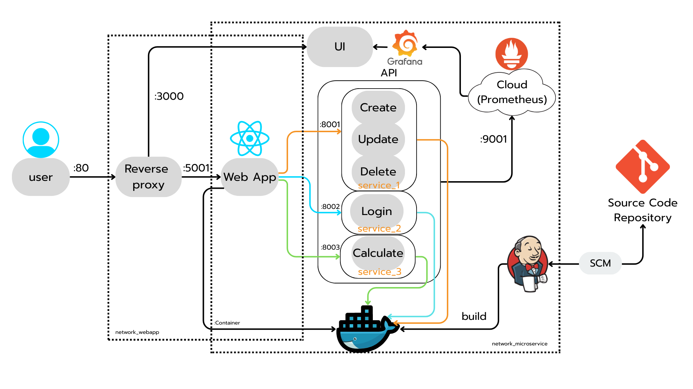

# 🎓 MyBoBox-Cashflow
- Web Application สำหรับการจัดการรายรับรายจ่าย ที่จะเก็บบันทึกทุกการเคลื่อนไหวของเงิน ตรวจสอบสถานะการเงินได้ทุกที่ทุกเวลา ใช้งานง่าย เหมาะสำหรับทุกคนที่ต้องการควบคุมการเงินอย่างมีระบบ

## 📝 Project Description

Brief summary of the project:
- การยืนยันตัวตนเพื่อเข้าสู่ระบบ / สมัครสมาชิก
- การเก็บบันทึกข้อมูล รายรับ-รายจ่าย
- เป้าหมาย : คนที่ต้องทำบัญชี รายรับ-รายจ่ายของตัวเอง

## 🧑‍💻 Authors

- Mr.Thanawit Yangngam - B6500900 - [GitHub](https://github.com/ThanawitGZS)
- Mr.Poramet withaisong - B6505295 - [GitHub](https://github.com/jarntae)
- Mr.Sirapat Pengchan - B6524951 - [GitHub](https://github.com/username)
- Mr.Sorrawit Poonnaimueng - B6525781 - [GitHub](https://github.com/A12ise)

> Course: ENG23 3074 Serverless and Cloud Architectures  
> Instructor: Asst. Prof. Dr. Nuntawut Kaoungku  
> University: Suranaree University of Technology  
> Semester/Term: 03/2025  

## 🏗️ System Architecture

Below is the high-level architecture of the project:

> _Tip: You can design your diagram using tools like [draw.io](https://draw.io), [Lucidchart](https://lucidchart.com), or [Excalidraw](https://excalidraw.com). Save the image in your project folder (e.g., `assets/architecture.png`) and update the path above._

