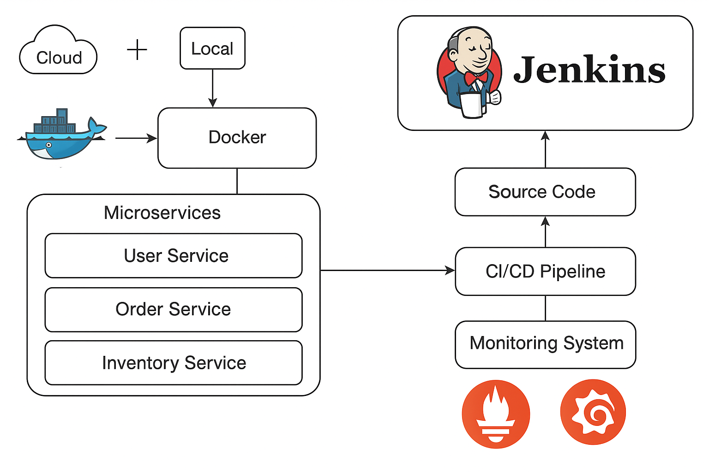

# 🎓 Project Title

_A short, descriptive title for your student project._

## 📝 Project Description

Brief summary of the project:
- What does it do?
- Why did you build it?
- Who is the target audience?

## 🧑‍💻 Authors

- Name 1 - Student ID - [GitHub](https://github.com/username)
- Name 2 - Student ID - [GitHub](https://github.com/username)

> Course: Course Name  
> Instructor: Instructor Name  
> University: Your University Name  
> Semester/Term: Fall 2025

## 🏗️ System Architecture

Below is the high-level architecture of the project:

> _Tip: You can design your diagram using tools like [draw.io](https://draw.io), [Lucidchart](https://lucidchart.com), or [Excalidraw](https://excalidraw.com). Save the image in your project folder (e.g., `assets/architecture.png`) and update the path above._

